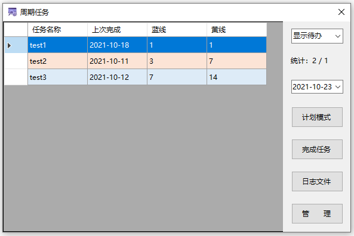

# 周期任务

  

周期任务管理工具。

## 环境

- 系统：Windows 10
- 应用程序：Visual Studio 2017
- 代码：C#
- 数据库：SQL Server 2008 R2

## 安装

- 复制项目文件到本机。
- 使用 `SQL Server 2008 R2` 打开 `CycleTask/Database/cycle_task_script.sql"`，并执行（该操作会创建一个数据库`cycle_task`）。
- 使用 `Visual Studio`（`2017`或更高版本）打开 `CycleTask/CycleTask.sln`。
- 指定日志文件位置 `CycleTask/CycleTask/CycleTaskForm.cs` `9行`。
- 运行程序

如需获取可执行文件，可在 `CycleTask/CycleTask/bin` 文件夹内找到可执行文件和数据库配置信息，并一起使用。

## 展示

## 许可证

MIT
